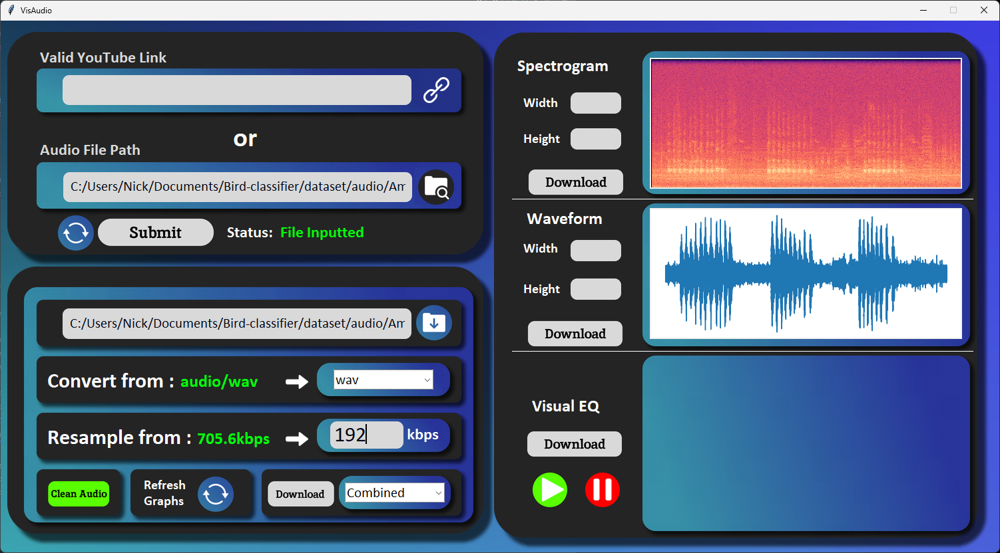

# VisAudio

VisAudio is a desktop app that is designed for audiophiles and personal audio manipulation.
It also comes with a built-in YouTube audio downloader!

## Goal

The main goal I had in mind when creating this app is to provide an easy way for me to manipulate audio for my various projects. With features such as format conversion, bitrate change, and noise reducing. I wanted to provide as many tools as possible in this window.

I also wanted a way to download YouTube audio easily and a simple way to manipulate it for projects such as video creation or song creation and analysis.

## Features

VisAudio has various features (and a lot more planned) built-into it and more in the future. Here are all the current features available:

- YouTube audio download option
- Audio file conversion with formats supported:
  - mp3
  - wav
  - flac
  - ogg
  - m4a
  - aac
- Custom bit-rate resampling
- Noise reduction
- Download converted, resampled, or combined file
- Spectrogram Visualization/Download
- Waveform Visualization/Download

## Planned Features

There are a lot of planned features for this desktop app. Here are all the planned features so far:
- More graph customizations such as color palette, audio algorithm, mono/stereo graph, and custom frequency window
- Stereo splitting audio
- Visual EQ video visualization/download
- Audio file tagging such as Location, Name, and Cover Image
- *(Far future)* Song instrument splitting

# UI

# Usage

VisAudio is currently not ready for download and usage
